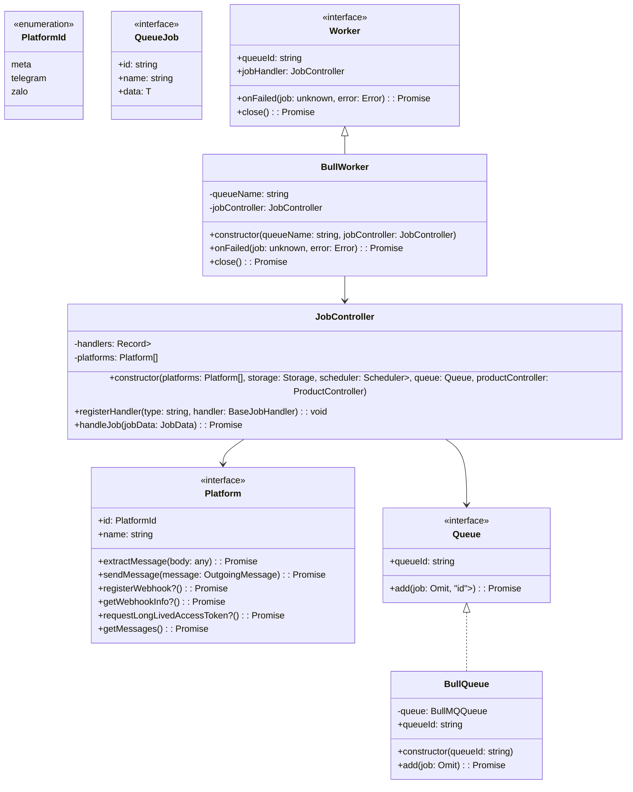
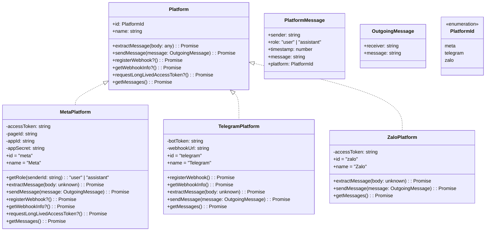

# Class Diagram

## Triển khai Worker

```mermaid
classDiagram

%% Interfaces
class Platform {
  <<interface>>
  +id: PlatformId
  +name: string
  +extractMessage(body: any): Promise<PlatformMessage>
  +sendMessage(message: OutgoingMessage): Promise<void>
  +registerWebhook?(): Promise<void>
  +getWebhookInfo?(): Promise<any>
  +requestLongLivedAccessToken?(): Promise<string>
  +getMessages(): Promise<PlatformMessage[]>
}

%% Enumeration (type)
class PlatformId {
  <<enumeration>>
  meta
  telegram
  zalo
}

%% QueueJob
class QueueJob {
  <<interface>>
  +id: string
  +name: string
  +data: T
}

%% Queue
class Queue {
  <<interface>>
  +queueId: string
  +add(job: Omit<QueueJob<T>, "id">): Promise<void>
}

%% BullQueue
class BullQueue {
  -queue: BullMQQueue
  +queueId: string
  +constructor(queueId: string)
  +add(job: Omit<QueueJob, "id">): Promise<void>
}

%% JobController
class JobController {
  -handlers: Record<string, BaseJobHandler<ID>>
  -platforms: Platform[]
  +constructor(platforms: Platform[], storage: Storage<ID>, scheduler: Scheduler<ID, JobData<ID>>, queue: Queue<JobData>, productController: ProductController)
  +registerHandler(type: string, handler: BaseJobHandler<ID>): void
  +handleJob(jobData: JobData): Promise<void>
}

%% Worker interface
class Worker {
  <<interface>>
  +queueId: string
  +jobHandler: JobController<ID>
  +onFailed(job: unknown, error: Error): Promise<void>
  +close(): Promise<void>
}

%% BullWorker
class BullWorker {
  -queueName: string
  -jobController: JobController
  +constructor(queueName: string, jobController: JobController)
  +onFailed(job: unknown, error: Error): Promise<void>
  +close(): Promise<void>
}

%% Relationships
JobController --> Platform
JobController --> Queue
Queue <|.. BullQueue
Worker <|-- BullWorker
BullWorker --> JobController

```

## Triển khai Platform

```mermaid
classDiagram

%% Interfaces
class Platform {
  +id: PlatformId
  +name: string
  +extractMessage(body: any): Promise<PlatformMessage>
  +sendMessage(message: OutgoingMessage): Promise<void>
  +registerWebhook?(): Promise<void>
  +getWebhookInfo?(): Promise<any>
  +requestLongLivedAccessToken?(): Promise<string>
  +getMessages(): Promise<PlatformMessage[]>
}

class PlatformMessage {
  +sender: string
  +role: "user" | "assistant"
  +timestamp: number
  +message: string
  +platform: PlatformId
}

class OutgoingMessage {
  +receiver: string
  +message: string
}

%% Enumeration (type)
class PlatformId {
  <<enumeration>>
  meta
  telegram
  zalo
}

%% Implementation: Meta
class MetaPlatform {
  -accessToken: string
  -pageId: string
  -appId: string
  -appSecret: string
  +id = "meta"
  +name = "Meta"
  +getRole(senderId: string): "user" | "assistant"
  +extractMessage(body: unknown): Promise<PlatformMessage>
  +sendMessage(message: OutgoingMessage): Promise<void>
  +registerWebhook?(): Promise<void>
  +getWebhookInfo?(): Promise<any>
  +requestLongLivedAccessToken?(): Promise<string>
  +getMessages(): Promise<PlatformMessage[]>
}

%% Implementation: Telegram
class TelegramPlatform {
  -botToken: string
  -webhookUrl: string
  +id = "telegram"
  +name = "Telegram"
  +registerWebhook(): Promise<void>
  +getWebhookInfo(): Promise<JSON>
  +extractMessage(body: unknown): Promise<PlatformMessage>
  +sendMessage(message: OutgoingMessage): Promise<void>
  +getMessages(): Promise<PlatformMessage[]>
}

%% Implementation: Zalo
class ZaloPlatform {
  -accessToken: string
  +id = "zalo"
  +name = "Zalo"
  +extractMessage(body: unknown): Promise<PlatformMessage>
  +sendMessage(message: OutgoingMessage): Promise<void>
  +getMessages(): Promise<PlatformMessage[]>
}

%% Relationships
Platform <|.. MetaPlatform
Platform <|.. TelegramPlatform
Platform <|.. ZaloPlatform
```
