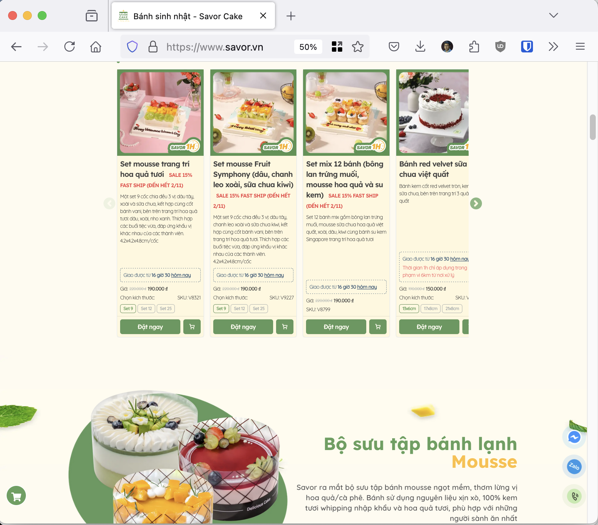

# Project 1: Xây Dựng Chatbot Đa Nền Tảng Hỗ Trợ Đặt Bánh Sinh Nhật Online

- Sinh viên thực hiện: Lê Tuấn Hiệp
- Trường Đại Học Bách Khoa Hà Nội
- Ngày bắt đầu: 10/2024

---

## Mục lục

<!-- @import "[TOC]" {cmd="toc" depthFrom=1 depthTo=6 orderedList=false} -->

<!-- code_chunk_output -->

- [Project 1: Xây Dựng Chatbot Đa Nền Tảng Hỗ Trợ Đặt Bánh Sinh Nhật Online](#project-1-xây-dựng-chatbot-đa-nền-tảng-hỗ-trợ-đặt-bánh-sinh-nhật-online)
  - [Mục lục](#mục-lục)
  - [I. Khái quát vấn đề](#i-khái-quát-vấn-đề)
    - [1. Giới thiệu](#1-giới-thiệu)
    - [2. Yêu cầu đối với giải pháp](#2-yêu-cầu-đối-với-giải-pháp)
    - [3. Hiện trạng](#3-hiện-trạng)
  - [II. Tổng quan lý thuyết](#ii-tổng-quan-lý-thuyết)
    - [1. Lựa chọn hệ quản trị cơ sở dữ liệu](#1-lựa-chọn-hệ-quản-trị-cơ-sở-dữ-liệu)
      - [1.1. Định nghĩa](#11-định-nghĩa)
      - [1.2. Lựa chọn MongoDB làm DBMS](#12-lựa-chọn-mongodb-làm-dbms)
        - [1.2.1. Cấu trúc dữ liệu linh hoạt](#121-cấu-trúc-dữ-liệu-linh-hoạt)
        - [1.2.2. Đảm bảo tính nhất quán cho dữ liệu từ đa nền tảng](#122-đảm-bảo-tính-nhất-quán-cho-dữ-liệu-từ-đa-nền-tảng)
        - [1.2.3. Khả năng mở rộng và tối ưu hiệu suất](#123-khả-năng-mở-rộng-và-tối-ưu-hiệu-suất)
      - [1.3 Kết luận](#13-kết-luận)
    - [2. Thiết kế kiến trúc phần mềm chatbot đa nền tảng](#2-thiết-kế-kiến-trúc-phần-mềm-chatbot-đa-nền-tảng)
      - [2.1 Mẫu thiết kế tiếp hợp (Adapter Design Pattern)](#21-mẫu-thiết-kế-tiếp-hợp-adapter-design-pattern)
        - [Ví dụ về mẫu thiết kế tích hợp](#ví-dụ-về-mẫu-thiết-kế-tích-hợp)
      - [2.2. Kiến trúc hướng sự kiện trong Node.js](#22-kiến-trúc-hướng-sự-kiện-trong-nodejs)
      - [2.3. Các thách thức khi tích hợp API nền tảng](#23-các-thách-thức-khi-tích-hợp-api-nền-tảng)
      - [2.4. Kết luận](#24-kết-luận)
    - [3. Xử lý Yêu cầu Khách hàng: So sánh NLP và GenAI trong Chatbot](#3-xử-lý-yêu-cầu-khách-hàng-so-sánh-nlp-và-genai-trong-chatbot)
      - [3.1. Chatbot dựa trên NLP](#31-chatbot-dựa-trên-nlp)
      - [3.2. AI tạo sinh và Mô hình Transformer](#32-ai-tạo-sinh-và-mô-hình-transformer)
      - [3.3. Phát hiện Mục đích so với Trò chuyện Mở](#33-phát-hiện-mục-đích-so-với-trò-chuyện-mở)
      - [3.4. Phương pháp Kết hợp](#34-phương-pháp-kết-hợp)
      - [3.5. Quy trình Tiền xử lý](#35-quy-trình-tiền-xử-lý)
      - [3.5. Kết luận](#35-kết-luận)
  - [III. Triển khai thực tế](#iii-triển-khai-thực-tế)
    - [1. Phiên bản thử nghiệm 0.1](#1-phiên-bản-thử-nghiệm-01)
    - [2. Phiên bản thử nghiệm 0.2](#2-phiên-bản-thử-nghiệm-02)
    - [3. Phiên bản thử nghiệm 0.3](#3-phiên-bản-thử-nghiệm-03)
    - [4. Phiên bản thử nghiệm 0.4](#4-phiên-bản-thử-nghiệm-04)
  - [IV. Tài liệu tham khảo](#iv-tài-liệu-tham-khảo)

<!-- /code_chunk_output -->

## I. Khái quát vấn đề

### 1. Giới thiệu

Công Ty Trách Nhiệm Hữu Hạn Savor Việt Nam (Website [www.savor.vn](https://www.savor.vn/), gọi tắt là Savor Cake) là một công ty cung cấp dịch vụ vận chuyển bánh sinh nhật theo đơn đặt hàng tại Hà Nội. Khách hàng có thể đặt hàng qua các kênh:

- Nhắn tin trực tuyến (chat) với nhân viên chăm sóc khách (NVCSKH) hàng qua các nền tảng mạng xã hội
- Đặt hàng qua website
- Gọi điện thoại trực tiếp

*Hình 1: Giao diện Website của Savor Cake*

Hiện nay số lượng đơn hàng đặt bánh ngày càng tăng. Tỉ trọng đặt đơn hàng qua hình thức Nhắn tin trực tuyến luôn duy trì ở mức 60% - 70% tạo ra áp lực lớn trong việc tăng số lượng NVCSKH cũng như đảm bảo chất lượng phục vụ. Vì thế, Savor Cake có nhu cầu triển khai phần mềm chăm sóc khách hàng (Chatbot) tự động qua tin nhắn để giải quyết vấn đề trên.

### 2. Yêu cầu đối với giải pháp

Phần mềm chatbot cần có khả năng xử lý phần lớn các nhu cầu hiện có của khách hàng bao gồm: tư vấn sản phẩm, đặt hàng, hỏi đáp về tình trạng đơn đặt hàng, thay đổi đơn đặt hàng, hỏi đáp về các chính sách của Savor Cake bao gồm: vận chuyển, đổi trả.

Ngoài ra phần mềm cần hoạt động được ở nhiều nền tảng khác nhau (đa nền tảng). Phiên bản đầu tiên cần vận hành tốt ở hai nền tảng đang được sử dụng nhiều nhất hiện nay là Facebook Messenger và Zalo Official Account. Sau đó, chatbot cần có khả năng tích hợp thêm các nền tảng khác trong tương lai, ví dụ như Chat trên Website, Telegram, Whatsapp, v.v.

Một số nghiệp vụ đặc thù như xử lý khiếu nại, tư vấn đối với các mẫu bánh đặt hàng riêng, tư vấn đơn bán sỉ vẫn cần được xử lý bởi các NVCSKH. Vì vậy, phần mềm cũng cần đảm bảo hoạt động hiệu quả song song với NVCSKH, giúp khách hàng có trải nghiệm mượt mà khi chuyển từ việc tương tác với chatbot sang tương tác với NVCSKH và ngược lại.

### 3. Hiện trạng

- Savor Cake đã có tài khoản Facebook Page và Zalo Official Account. Phần trả lời Facebook Page đã có tích hợp chatbot trả lời tin nhắn tự động ở mức độ cơ bản: Khi khách hàng bắt đầu cuộc hôi thoại, chatbot nhắn tin theo kịch bản tư vấn, khách hàng trả lời bằng cách chọn trong số các tùy chọn được đưa ra sẵn. Chatbot hiện tại chưa thể trả lời các câu hỏi ngoài kịch bản, và chưa xử lý các trường hợp khách trả lời câu hỏi bằng ngôn ngữ tự nhiên thay vì chọn tùy chọn.
- Savor Cake đã có một trang web riêng tại địa chỉ https://www.savor.vn, với cơ sở dữ liệu về sản phẩm bao gồm các tập hợp (collections) và một số các trường (fields) cơ bản như:
  - Sản phẩm (`Products`)
    - Tên sản phẩm (`description`)
    - Giá bán sản phẩm (`price`)
    - Giá khuyến mãi sản phẩm (`salePrice`)
    - Hình ảnh sản phẩm (`image`)
    - Mô tả sản phẩm (`content`)
    - Các nhóm sản phẩm (`productCollections`)
  - Nhóm sản phẩm (`ProductCollections`)
    - Tên nhóm sản phẩm (`description`)
  - Đơn đặt hàng (`Orders`) cùng các trường liên quan.
  - Khách hàng (`Customers`) cùng các trường liên quan.

## II. Tổng quan lý thuyết

### 1. Lựa chọn hệ quản trị cơ sở dữ liệu

#### 1.1. Định nghĩa

Theo định nghĩa trong môn học Nhập môn Cơ sở dữ liệu, hệ quản trị cơ sở dữ liệu (Database Management System - DBMS) là một phần mềm cho phép tạo lập các cơ sở dữ liệu cho các ứng dụng phần mềm. DBMS cho phép định nghĩa các kiểu, cấu trúc và ràng buộc dữ liệu. Ngoài ra, DBMS còn cung cấp các công cụ để tạo lập, lưu trữ trên thiết bị nhớ, quản lý và truy vấn cơ sở dữ liệu. DBMS sử dụng ngôn ngữ truy vấn dữ liệu (Data Query Language - DQL) để tương tác với cơ sở dữ liệu.

Một trong số các cách phân loại DBMS là phân loại theo mô hình dữ liệu. Cụ thể, phổ biến nhất hiện nay ta có các kiểu mô hình dữ liệu:
- Mô hình dữ liệu quan hệ (Relational Model), thường sử dụng ngôn ngữ truy vấn SQL. Các DBMS thường thấy là MySQL, PostgreSQL, SQL Server, Oracle, v.v.
- Mô hình dữ liệu tài liệu (Document Model), thường sử dụng ngôn ngữ truy vấn NoSQL. Các DBMS thường thấy là MongoDB, CouchDB, v.v.
- Mô hình dữ liệu dạng đồ thị (Graph-like Model), thường sử dụng ngôn ngữ truy vấn như Cypher, SPARQL hay Datalog. Các DBMS thường thấy là Neo4j, Amazon Neptune, v.v.

#### 1.2. Lựa chọn MongoDB làm DBMS

Để xây dựng chatbot tương tác với khách hàng đa nền tảng, việc lựa chọn DBMS phù hợp là yếu tố quan trọng ảnh hưởng trực tiếp đến hiệu năng, khả năng mở rộng và tính linh hoạt của phần mềm. DBMS cần dễ dàng lưu trữ nhiều dạng dữ liệu khác nhau từ các nền tảng như Facebook Messenger, Zalo, Telegram, v.v. trong khi vẫn phải đảm việc theo dõi liền mạch tất cả tương tác với khách hàng. MongoDB, một DBMS với mô hình dữ liệu NoSQL, là lựa chọn rất phổ biến cho các dự án tương tự nhờ vào cấu trúc dữ liệu linh hoạt (schema flexibility), khả năng mở rộng theo chiều ngang (horizontal scalability) và khả năng lưu trữ dữ liệu ở dạng tài liệu (document-based data storage). Phần sau đây sẽ trình bày chi tiết các cân nhắc khi lựa chọn MongoDB làm DBMS cho phần mềm chatbot.

##### 1.2.1. Cấu trúc dữ liệu linh hoạt

Một trong số những lợi thế chính của việc sử dụng MongoDB là thiết kế không có cấu trúc (schema-less), cho phép lưu trữ linh hoạt các cấu trúc dữ liệu. Mỗi khi các nền tảng cập nhật API hoặc giới thiệu tính năng mới, dẫn đến sự thay đổi trong cấu trúc dữ liệu, các DBMS theo mô hình quan hệ truyền thống sẽ đòi hỏi việc di chuyển cơ sở dữ liệu (database migration) phức tạp. Ngược lại, mô hình dữ liệu tài liệu của MongoDB rất dễ thích ứng với các yêu cầu thay đổi, cho phép lưu trữ dữ liệu từ nhiều nguồn khác nhau mà không bị ràng buộc bởi các giới hạn cấu trúc nghiêm ngặt (Fang & Zhang, 2019).

Thông tin về người dùng, lịch sử tương tác và các thông tin riêng cho từng nền tảng đều có thể được lưu trữ nhúng (embedded) trong các tài liệu (documents) của MongoDB. Điều này giúp hệ thống chatbot có thể quản lý các thông tin riêng của nền tảng một cách hiệu quả, mà vẫn giữ được tính nhất quán (consistency) của dữ liệu chung. Ví dụ, cùng một người dùng có thể vừa tương tác với chatbot qua Facebook Messenger, vừa tương tác với chatbot qua Zalo, nhưng nội dung tương tác vẫn có thể được lưu trữ ở trên cùng một tập hợp (collection) của MongoDB. Điều này khó có thể thực hiện với các DBMS truyền thống khi cần phải lưu trữ dữ liệu ở mỗi nền tảng với cấu trúc dữ liệu khác nhau các một bảng (table) riêng biệt.

Ngoài ra, do các cuộc hội thoại thường có nhiều phiên, mỗi phiên bao gồm nhiều tin nhắn, việc lưu trữ dữ liệu dạng tài liệu cũng có thể giúp việc quản lý lưu trữ hiệu quả hơn khi mỗi phiên được lưu trữ ở một tài liệu, và các tin nhắn trong mỗi phiên có thể được lưu trữ nhúng vào một mảng (array) trong phiên đó. Điều này giúp tạo ra những cuộc hội thoại tự nhiên, cá nhân hóa, và có ngữ cảnh (contextual) hơn cho khách hàng.

##### 1.2.2. Đảm bảo tính nhất quán cho dữ liệu từ đa nền tảng

Khi làm việc với đa nền tảng, việc đảm bảo tính nhất quán dữ liệu khi một người dùng tương tác với chatbot trên nhiều nền tảng khác nhau là điều vô cùng quan trọng. Một phương pháp hiệu quả để xử lý vấn đề này là dùng một định danh người dùng hợp nhất (unified user identifier) cho mỗi người dùng. Định danh người dùng hợp nhất là một giá trị duy nhất đại diện cho một người dùng (`user_id`) trên tất cả các nền tảng. Điều này giúp người dùng có trải nghiệm mượt mà khi tương tác giữa các nền tảng khác nhau.

Để quản lý các cấu trúc dữ liệu khác nhau từ các nền tảng, cấu trúc dữ liệu linh hoạt của MongoDB cho phép nhà phát triển lưu trữ các thông tin riêng của nền tảng vào một tài liệu con (sub-document) của tài liệu chính. Như vậy, thông tin chính vẫn đảm bảo tính nhất quán, trong khi các thông tin riêng của nền tảng vẫn được lưu trữ đầy đủ phục vụ các chức năng riêng biệt của nền tảng.

##### 1.2.3. Khả năng mở rộng và tối ưu hiệu suất

Khi phần mềm chatbot mở rộng về quy mô, số lượng người dùng, số lượng cuộc hội thoại thực hiện đồng thời, số lượng truy vấn thời gian thực cũng tăng lên. MongoDB sử dụng kỹ thuật như phân mảnh (sharding), đồng bộ hóa (replication), v.v. là đặc biệt quan trọng giúp cho hệ thống có thể mở rộng theo chiều ngang một cách hiệu quả. Kĩ thuật phân mảnh giúp dữ liệu được phân tán trên nhiều máy chủ khách nhau, tăng băng thông đọc/ghi (read/write throughput) và đảm bảo không có máy chủ nào trở thành điểm thắt cổ chai (bottleneck) của hệ thống trong thời gian cao điểm.

Các nghiên cứu cho thấy các ứng dụng chat bot phân tán bằng `user_id` hoặc các định danh của nền tảng có thể phân tán dữ liệu hiệu quả, giảm độ trễ (latency) cũng như tăng tốc độ truy vấn (query performance). Ngoài ra, việc đánh chỉ mục (indexing) các trường hay được dùng như `user_id`, `conversationTimestamp`, và `platform` cũng đóng góp đáng kể cho việc gia tăng hiệu quả truy vấn khi chatbot thường xuyên cần truy cập đến các cuộc hội thoại gần đây nhất của người dùng.

Ngoài ra, do dữ liệu hội thoại gia tăng khá nhanh về số lượng, đồng nghĩa với dung lượng lưu trữ tăng lên, gây xuống cấp hiệu suất truy vấn (performance degradation), cần bổ sung thêm việc việc di dời (offloading) dữ liệu hội thoại cũ khỏi cơ sở dữ liệu chính đến một giải pháp lưu trữ khác phù hợp hơn. Việc này giúp vẫn giữ được các dữ liệu cũ, nhưng vấn đảm bảo dữ liệu hiện tại hoạt động với hiệu năng cao.

#### 1.3 Kết luận

Phần trên đã nêu ra các tiêu chí bao gồm: sự linh hoạt trong cấu trúc dữ liệu, khả năng mở rộng và hiệu suất cao cho một ứng dụng chatbot đa nền tảng. MongoDB nhờ vào mô hình dữ liệu tài liệu, khả năng mở rộng theo chiều ngang nhờ kĩ thuật phân mảnh, và một loạt các kĩ thuật tối ưu hiệu suất khác là một lựa chọn hợp lý cho việc xây dựng phần mềm chatbot đa nền tảng.

### 2. Thiết kế kiến trúc phần mềm chatbot đa nền tảng

Việc thiết kế kiến trúc phần mềm cho chatbot đa nền tảng yêu cầu sự cân nhắc kỹ lượng về tính linh hoạt, khả năng mở rộng và khả năng bảo trì lâu dài. Một thiết kế tốt đảm bảo hệ thống có thể xử lý hiệu quả các tương tác từ các nền tảng khác nhau, trong khi đó vẫn đem đến trải nghiệm nhất quán cho người dùng. Trong ngữ cảnh này, ta có thể sử dụng mẫu thiết kế tiếp hợp (adapter pattern) để cô lập các logic riêng của từng nền tảng, biến giao diện (interface) không tương thích thành giao diện tương thích với giao diện logic chính của chatbot.

#### 2.1 Mẫu thiết kế tiếp hợp (Adapter Design Pattern)

Mẫu thiết kế adapter được coi là một giải pháp thiết thực để tích hợp các hệ thống đa nền tảng. Bằng cách trừu tượng hóa các chi tiết dành riêng cho nền tảng, mẫu thiết kế này cho phép các nhà phát triển quản lý sự khác biệt giữa các nền tảng mà không cần thay đổi logic cốt lõi của chatbot.  Tính mô-đun này rất quan trọng để đảm bảo hệ thống không bị lỗi thời, cho phép tích hợp các nền tảng mới với những thay đổi tối thiểu đối với kiến trúc cốt lõi của chatbot.

Trong một ứng dụng chatbot với bản chất hướng sự kiện (event-driven), mỗi adapter dành riêng cho nền tảng có thể được thiết kế để giao tiếp với các API của các dịch vụ nhắn tin khác nhau trong khi quá trình chuyển dữ liệu sang dạng tiêu chuẩn hóa trở lại logic cốt lõi của chatbot đang diễn ra. Việc tách biệt các mối quan tâm này giúp đơn giản hóa cả việc bảo trì và thử nghiệm, vì những thay đổi dành riêng cho nền tảng được giới hạn trong các adapter tương ứng

##### Ví dụ về mẫu thiết kế tích hợp
Chatbot có thể có một adapter cho mỗi nền tảng nhắn tin (Zalo, Facebook Messenger, Telegram) và tất cả các adapter đều tương tác với hệ thống lõi theo cùng một cách. Cấu trúc này đảm bảo rằng bất kỳ nền tảng mới nào (chẳng hạn như WhatsApp hoặc Viber) đều có thể dễ dàng được thêm vào bằng cách tạo một adapter mới mà không cần thay đổi logic lõi của chatbot.

#### 2.2. Kiến trúc hướng sự kiện trong Node.js

Kiến trúc hướng sự kiện (Event Driven Architecture) trong Node.js là một khía cạnh quan trọng khác của việc thiết kế các hệ thống chatbot có khả năng mở rộng. Node.js, vốn không đồng bộ và không chặn, rất xuất sắc trong việc xử lý nhiều sự kiện đồng thời, khiến nó trở nên lý tưởng cho các ứng dụng thời gian thực như chatbot xử lý các tin nhắn từ nhiều người dùng đồng thời.

Các tài liệu cho thấy các hệ thống hướng sự kiện rất phù hợp cho các ứng dụng chatbot, trong đó các sự kiện khác nhau — chẳng hạn như tin nhắn đến của người dùng, trả lời đi và các lệnh gọi API đến các dịch vụ của bên thứ ba — xảy ra không đồng bộ (Richter & Coronel, 2020). Bằng cách sử dụng vòng lặp sự kiện và cơ chế gọi lại của Node.js, hệ thống có thể xử lý hiệu quả các nhu cầu I/O cao điển hình của các tương tác dựa trên trò chuyện trên nhiều nền tảng.

Những lợi ích chính của Kiến trúc Hướng sự kiện:
- Tính đồng thời: Khả năng xử lý nhiều sự kiện đồng thời của Node.js cho phép chatbot quản lý nhiều cuộc trò chuyện mà không gặp phải sự cố chặn luồng, đảm bảo thời gian phản hồi nhanh chóng.
- Khả năng mở rộng: Khi số lượng người dùng hoặc nền tảng tăng lên, kiến trúc hướng sự kiện có thể mở rộng theo chiều ngang bằng cách phân phối các sự kiện trên nhiều phiên bản hoặc dịch vụ vi mô, tăng cường hơn nữa hiệu suất khi tải nặng.

#### 2.3. Các thách thức khi tích hợp API nền tảng

Tích hợp API là một khía cạnh quan trọng khi thiết kế phần mềm chatbot, đặc biệt là khi tương tác với các nền tảng khác nhau như Zalo, Facebook Messenger và Telegram. Mỗi nền tảng có bộ API, giới hạn tỷ lệ (rate limiting) và cơ chế xác thực riêng, cần được xử lý riêng rẽ cẩn thận để đảm bảo phần mềm hoạt động mượt mà. Việc thiết kế các giao diện API tốt sẽ cho phép chatbot giao tiếp hiệu quả với từng nền tảng, đảm bảo rằng việc phân phối tin nhắn, xác thực người dùng và định dạng phản hồi tuân thủ các thông số kỹ thuật của nền tảng.

Cần chú ý đến các vấn đề sau:
- **Giới hạn tỷ lệ:** Mỗi nền tảng nhắn tin áp đặt giới hạn tỷ lệ đối với số lượng lệnh gọi API được phép trên mỗi khung thời gian. Các cơ chế xử lý lỗi và đóng gói tin nhắn hiệu quả phải được áp dụng để tránh việc điều chỉnh hoặc trì hoãn tin nhắn.
- **Xác thực:** Các nền tảng có thể yêu cầu các cơ chế xác thực khác nhau, chẳng hạn như OAuth cho Facebook Messenger hoặc khóa API cho Telegram. Kiến trúc phải xử lý những điều này một cách liền mạch trên các adapter, đảm bảo giao tiếp an toàn.
- **Các tính năng dành riêng cho Nền tảng:** Mỗi nền tảng cung cấp các tính năng độc đáo — chẳng hạn như hỗ trợ phương tiện phong phú, trả lời nhanh hoặc nhãn dán — có thể cần xử lý dành riêng cho nền tảng. Kiến trúc nên đảm bảo rằng các tính năng này được hỗ trợ mà không ảnh hưởng đến tính nhất quán của logic chatbot cốt lõi.

Bằng cách thiết kế một lớp API có khả năng mở rộng, chatbot có thể tích hợp với nhiều nền tảng khác nhau trong khi vẫn duy trì tính linh hoạt để thêm các nền tảng mới trong tương lai. Việc áp dụng mẫu thiết kế adapter sẽ đơn giản hóa hơn nữa quy trình này, vì tích hợp nền tảng mới chỉ yêu cầu phát triển một adapter mới mà không cần thay đổi logic API cốt lõi.

#### 2.4. Kết luận

Thiết kế kiến trúc phần mềm cho một chatbot đa nền tảng đòi hỏi sự cân nhắc cẩn thận về tính mô-đun, khả năng mở rộng và khả năng thời gian thực. Mẫu thiết kế adapter, kết hợp với kiến trúc hướng sự kiện trong Node.js, cung cấp một chiến lược hiệu quả để quản lý logic dành riêng cho nền tảng trong khi vẫn duy trì logic cốt lõi nhất quán. Tích hợp API và xử lý các thách thức dành riêng cho nền tảng như giới hạn tỷ lệ và xác thực cũng rất quan trọng để đảm bảo chatbot hoạt động liền mạch trên nhiều nền tảng.

### 3. Xử lý Yêu cầu Khách hàng: So sánh NLP và GenAI trong Chatbot

Xử lý hiệu quả các yêu cầu của khách hàng là cốt lõi của chức năng chatbot, và hai phương pháp chính đã xuất hiện: phương pháp **Xử lý Ngôn ngữ Tự nhiên (NLP)** truyền thống và mô hình **AI tạo sinh (Generative AI - viết tắt GenAI)** tiên tiến. Mỗi phương pháp đều có những điểm mạnh riêng, từ độ tin cậy dựa trên quy tắc trong các phản hồi có cấu trúc đến tính linh hoạt của các mô hình tạo sinh có khả năng tạo ra các tương tác giống con người. Phần này đánh giá sự khác biệt giữa chatbot dựa trên NLP và chatbot dựa trên AI, khám phá sự lựa chọn giữa phản hồi theo hướng mục đích và phản hồi mở, thảo luận về các phương pháp kết hợp và kiểm tra các quy trình tiền xử lý cần thiết để hiểu đầu vào của người dùng.

#### 3.1. Chatbot dựa trên NLP

Các kỹ thuật NLP là nền tảng trong phát triển chatbot, cho phép chatbot xử lý ngôn ngữ bằng cách nhận dạng các mẫu, phân loại mục đích và trích xuất các thực thể từ đầu vào của người dùng. Các hệ thống này chủ yếu dựa vào các phương pháp dựa trên quy tắc hoặc thuật toán học máy, cho phép chúng xử lý các tác vụ cụ thể, có cấu trúc, chẳng hạn như trả lời Các câu hỏi thường gặp (FAQ) hoặc hướng dẫn người dùng thông qua quy trình công việc được xác định rõ ràng. Các công cụ như Rasa, Dialogflow và NLP.js cung cấp một khung cơ bản để phát triển chatbot dựa trên NLP, đặc biệt là trong các môi trường như Node.js, nơi các thư viện NLP như TensorFlow.js cung cấp khả năng xử lý ngôn ngữ mạnh mẽ (Hirschberg & Manning, 2015).

Nhiều nghiên cứu chỉ ra rằng các chatbot dựa trên NLP vượt trội hơn trong phân loại mục đích (intent classification), trích xuất từ ​​khóa (keyword extraction) và nhận dạng thực thể (entity recognition), khiến chúng phù hợp cho các tương tác liên quan đến đơn hàng hoặc liên quan đến thông tin cho trước. Bằng cách tập trung vào các mục đích được xác định trước, chatbot NLP có thể trả lời chính xác và nhất quán các câu hỏi thường gặp, theo dõi sở thích của người dùng và thậm chí quản lý các truy vấn liên quan đến đơn hàng. Tuy nhiên, chúng có thể gặp khó khăn trong việc hiểu ngôn ngữ mơ hồ hoặc phức tạp, điều này hạn chế khả năng thích ứng của chúng trong các cuộc trò chuyện mở.

#### 3.2. AI tạo sinh và Mô hình Transformer

AI tạo sinh, đặc biệt là các mô hình dựa trên transformer, đã thay đổi bối cảnh chatbot bằng cách cho phép các chatbot linh hoạt hơn. Các mô hình như GPT (Generative Pre-trained Transformer) của OpenAI tận dụng dữ liệu ngôn ngữ quy mô lớn để tạo ra các phản hồi mạch lạc, phù hợp với ngữ cảnh. Các mô hình tạo sinh cho phép chatbot tạo ra các phản hồi duy nhất một cách linh hoạt, thích ứng với các sắc thái cụ thể của truy vấn của người dùng, mang đến trải nghiệm tương tác giống con người hơn.

Mặc dù các mô hình AI tạo sinh mang lại sự linh hoạt đáng kể, nhưng chúng cũng đặt ra những thách thức trong việc triển khai và kiểm soát. Các mô hình này yêu cầu tinh chỉnh để phù hợp với tính cách của nhãn hiệu và tránh các phản hồi không phù hợp hoặc không liên quan, đặc biệt quan trọng trong bối cảnh dịch vụ khách hàng, nơi độ tin cậy và tuân thủ các chỉ dẫn về nhãn hiệu (brand guideline) là rất quan trọng. Ngoài ra, các mô hình tạo sinh có thể yêu cầu nguồn lực tính toán đáng kể và cần được giám sát cẩn thận để đảm bảo chúng luôn đi đúng chủ đề và phù hợp, điều này làm tăng thêm độ phức tạp của việc triển khai và bảo trì.

#### 3.3. Phát hiện Mục đích so với Trò chuyện Mở

Một cân nhắc chính trong thiết kế chatbot là tập trung vào **phát hiện mục đích** hay hỗ trợ **trò chuyện mở**. Phát hiện mục đích—thường được cung cấp bởi NLP—cho phép bot phân loại đầu vào của người dùng thành các mục đích được xác định trước (ví dụ: "kiểm tra trạng thái đơn hàng", "hỏi về giá"), cho phép các tương tác có cấu trúc và có thể dự đoán được. Cách tiếp cận này đặc biệt hiệu quả trong các ứng dụng dịch vụ khách hàng, nơi phần lớn các truy vấn nằm trong các danh mục đã biết. Ví dụ: chatbot bán bánh có thể sử dụng phát hiện mục đích để hướng dẫn người dùng thông qua các tùy chọn tùy chỉnh đơn hàng hoặc trả lời các câu hỏi phổ biến về hương vị hoặc thời gian giao hàng.

Ngược lại, trò chuyện mở—được hỗ trợ bởi AI tạo sinh—hỗ trợ các tương tác mang tính khám phá, linh hoạt hơn. Trong mô hình này, chatbot không bị giới hạn trong các mục đích được xác định trước mà có thể phản hồi dựa trên sự hiểu biết theo ngữ cảnh, điều này có lợi cho việc xử lý các cuộc trò chuyện phức tạp hoặc nhiều lượt. Tuy nhiên, các tương tác mở có thể tạo ra sự không thể đoán trước, khiến việc duy trì ranh giới đàm thoại trở nên khó khăn, đặc biệt là trong dịch vụ khách hàng, nơi độ chính xác và phù hợp là rất quan trọng.

#### 3.4. Phương pháp Kết hợp

Chúng ta có thể chọn phương pháp kết hợp, kết hợp NLP dựa trên quy tắc với AI tạo sinh, để trở thành một giải pháp hiệu quả để cân bằng tính linh hoạt và độ tin cậy trong các tương tác của chatbot. Trong mô hình kết hợp, nhận dạng mục đích do NLP điều khiển xử lý các truy vấn phổ biến, có thể dự đoán được, trong khi các mô hình tạo sinh quản lý các câu hỏi sắc thái hơn hoặc bất ngờ (Shah et al., 2019). Điều này cho phép chatbot xử lý các tương tác thường ngày với độ tin cậy cao trong khi tận dụng khả năng tạo sinh để giải quyết các yêu cầu phức tạp.

Phương pháp kết hợp thường sử dụng NLP để phân loại mục đích ban đầu, sau đó là phản hồi tạo sinh khi các mục đích được xác định trước là không đủ. Ví dụ: chatbot dịch vụ khách hàng có thể sử dụng NLP để xử lý các yêu cầu tiêu chuẩn nhưng chuyển sang mô hình tạo sinh khi xử lý các tình huống khách hàng độc đáo hoặc các cuộc trò chuyện được cá nhân hóa hơn. Bằng cách tích hợp cả hai phương pháp, chatbot có thể mang đến trải nghiệm nhất quán đồng thời vẫn thích ứng với nhu cầu đa dạng của khách hàng.

#### 3.5. Quy trình Tiền xử lý

Quy trình tiền xử lý rất cần thiết trong cả chatbot NLP và AI tạo sinh để đảm bảo diễn giải chính xác đầu vào của người dùng. Tiền xử lý bao gồm các bước như chuẩn hóa văn bản, mã hóa và nhận dạng thực thể được đặt tên (NER), giúp chatbot hiểu và xử lý dữ liệu văn bản đến. Nghiên cứu chỉ ra rằng tiền xử lý mạnh mẽ giúp nâng cao độ chính xác của chatbot bằng cách giảm nhiễu và chuẩn hóa đầu vào, giúp mô hình dễ dàng phát hiện mục đích hoặc tạo phản hồi phù hợp hơn.

Trong Node.js, các thư viện như Natural và spaCy hỗ trợ các quy trình tiền xử lý bằng cách cung cấp các công cụ để mã hóa, chuyển đổi từ và NER. Ví dụ: mã hóa chia văn bản thành các đơn vị có nghĩa (mã thông báo), trong khi NER xác định các thực thể quan trọng (chẳng hạn như tên, ngày tháng hoặc địa điểm) trong đầu vào của người dùng. Lớp nền tảng này cải thiện cả chatbot dựa trên NLP và chatbot tạo sinh bằng cách cho phép chúng nắm bắt các chi tiết quan trọng trong các cuộc trò chuyện và phản hồi theo ngữ cảnh hơn.

#### 3.5. Kết luận

Xử lý hiệu quả các yêu cầu của khách hàng là yêu cầu trọng tâm đối với chatbot trong dịch vụ khách hàng và việc lựa chọn giữa NLP và AI tạo sinh phụ thuộc vào độ phức tạp của các tương tác dự kiến. Chatbot dựa trên NLP đáng tin cậy cho các tương tác có cấu trúc, dựa trên mục đích, trong khi AI tạo sinh mang lại tính linh hoạt cho các cuộc trò chuyện mở, năng động hơn. Phương pháp kết hợp, kết hợp phương pháp dựa trên quy tắc và phương pháp tạo sinh, cung cấp một giải pháp cân bằng, cho phép chatbot xử lý cả truy vấn thông thường và truy vấn sắc thái. Ngoài ra, các quy trình tiền xử lý mạnh mẽ giúp cải thiện khả năng diễn giải chính xác đầu vào của người dùng của chatbot, nâng cao độ tin cậy và hiệu quả của cả mô hình NLP và mô hình tạo sinh.

## III. Triển khai thực tế

Dự án này chọn cách tiếp cận theo phương pháp Agile để phát triển, với các phiên bản được phát hành theo từng giai đoạn.

### 1. Phiên bản thử nghiệm 0.1

Phiên bản này chủ yếu để xây dựng nền tảng hoạt động cho chatbot với những chức năng hết sức cơ bản nhưng có thể kiểm tra hoạt động đầu cuối. Kết thúc phiên bản này, chúng ta cân có một chatbot không thông mình nhưng phản hồi được tin nhắn từ người dùng, truy xuất được hội thoại từ MongoDB, truy xuất được dữ liệu sản phẩm từ API của website, và có thể tương tác với người dùng thông qua ít nhất 1 nền tảng như Facebook Messenger.

Trong Agile, ta sẽ phát triển các câu chuyện người dùng (user stories) và các công việc con (tasks) để hoàn thành các công việc của từng câu chuyện.

Các user stories và tasks cụ thể của phiên bản này là:

- [ ] Khi người dùng chào, chatbot phản hồi và chào người dùng
  - [ ] Đăng ký một Page trên Facebook để chatbot có thể nhận tin nhắn
  - [ ] Viết một chatbot đơn giản trên Node.js có thể nhận tin nhắn và trả lời tin nhắn đơn giản
- [ ] Khách hàng muốn tư vấn (tìm kiếm mẫu bánh), chatbot có thể gợi ý vài mẫu bánh ngẫu nhiên
  - [ ] Dùng API của website để lấy ngẫu nhiên 5 mẫu bánh
  - [ ] Phát hiện khách muốn "tư vấn" nếu tin nhắn có từ khóa "tư vấn"
  - [ ] Hiển thị 5 mẫu bánh dưới dạng nút bấm
- [ ] Khách hàng chọn một mẫu bánh, chatbot sẽ hiển thị thông tin về mẫu bánh đó
  - [ ] Phát hiện khách hàng chọn mẫu bánh nào bằng cách lấy thông tin trả về của nút bấm
  - [ ] Hiển thị thông tin về mẫu bánh đó qua API của website
  - [ ] Hiển thị nút bấm để khách hàng chốt đặt hàng
- [ ] Khách hàng chốt đặt hàng, chatbot cho khách hàng form để điền thông tin giao nhận và phương thức thanh toán
  - [ ] Phát hiện khách hàng chốt đặt hàng bằng cách lấy thông tin trả về của nút bấm
  - [ ] Hiển thị form để khách điền thông tin đặt hàng
  - [ ] Lưu trữ form vào MongoDB cùng với thông tin sản phẩm khách đang chọn
- [ ] Khách hàng chốt mẫu và điền đầy đủ thông tin, chatbot sẽ tạo đơn đặt hàng và gửi lại thông tin đơn đặt hàng cho khách hàng
  - [ ] Tạo đơn đặt hàng và lưu vào MongoDB
  - [ ] Gửi thông tin đơn đặt hàng cho khách hàng qua tin nhắn

Mục đích của phiên bản này là có một sản phẩm demo hoàn chỉnh, tuy chatbot vẫn còn đơn giản nhưng có thể hoạt động được đầu cuối.

### 2. Phiên bản thử nghiệm 0.2

Phiên bản này tập trung vào việc tăng cường khả năng phân loại mục đích, loại bỏ việc giới hạn của khách hàng phải tương tác bằng nút bấm thay vì ngôn ngữ tự nhiên, đồng thời tăng tính tự nhiên của chatbot bằng cách xử lý thông tin ngắt quãng vào phản hồi thông tin liên tục chia thành nhiều tin nhắn nhỏ

Các user stories và tasks cụ thể của phiên bản này là:

- [ ] Khách hàng có thể nhắn tin ngắt thành nhiều tin nhắn khác nhau, và chatbot sẽ trả lời khi nhận được tin nhắn cuối cùng
  - [ ] Lưu tin nhắn ở dạng cuộc hội thoại (conversation) thay vì từng tin riêng lẻ
  - [ ] Thêm delay trước khi chatbot trả lời để mô phỏng việc người dùng nhắn tin ngắt quãng
- [ ] Khách hàng nhận được các tin nhắn nhỏ liên tục thay vì một tin nhắn lớn
  - [ ] Chia tin nhắn thành nhiều tin nhắn nhỏ hơn
  - [ ] Hiển thị các tin nhắn nhỏ liên tục
  - [ ] Hiển thị trạng thái đang gõ (đang gửi tin nhắn) giữa các tin nhắn
- [ ] Khách hàng có thể tìm kiếm sản phẩm bằng cách gửi tin nhắn chứa câu hỏi chung chung
  - [ ] Phát hiện khách hàng có tìm kiếm sản phẩm bằng cách lấy thông tin trả về của tin nhắn
  - [ ] Trích xuất từ khóa tìm kiếm cơ bản
- [ ] Khách hàng có thể chọn sản phẩm bằng cách gửi tin nhắn thay vì bấm nút
  - [ ] Phát hiện khách hàng chọn sản phẩm bằng cách lấy thông tin trả về của tin nhắn
  - [ ] Trích xuất ID sản phẩm

### 3. Phiên bản thử nghiệm 0.3

Phiên bản này sẽ tăng cường khả năng trích xuất từ khóa, nhận dạng thực thể của chatbot, bằng cách thêm các tính năng như:

- [ ] Khách hàng có thể tìm kiếm sản phẩm theo tên sản phẩm
  - [ ] Bổ sung API tìm kiếm sản phẩm theo tên sản phẩm
  - [ ] Trích xuất từ khóa tìm kiếm
- [ ] Khách hàng có thể tìm kiếm sản phẩm theo mức giá
  - [ ] Bổ sung API tìm kiếm sản phẩm theo mức giá
  - [ ] Trích xuất mức giá tìm kiếm
- [ ] Khách hàng có thể tìm kiếm sản phẩm theo thời gian giao hàng
  - [ ] Bổ sung API tìm kiếm sản phẩm theo thời gian giao hàng
  - [ ] Trích xuất thời gian giao hàng tìm kiếm
- [ ] Khách hàng có thể tìm kiếm sản phẩm bằng cách gửi ảnh sản phẩm
  - [ ] Bổ sung API tìm kiếm sản phẩm theo ảnh

Một trong số các thói quen thường thấy của khách hàng là gửi ảnh chụp màn hình của một chiếc bánh trên website để đặt hàng. Đối với API tìm kiếm sản phẩm bằng ảnh, có thể sử dụng các dịch vụ của bên thứ 3 trong phiên bản này.

### 4. Phiên bản thử nghiệm 0.4

(Tiếp tục cập nhật)

## IV. Tài liệu tham khảo

- [MongoDB Architecture Guide](https://www.mongodb.com/lp/resources/products/fundamentals/mongodb-architecture-guide)
- [Factory Method](https://refactoring.guru/design-patterns/factory-method)
- [Adapter](https://refactoring.guru/design-patterns/adapter)
- [Strategy](https://refactoring.guru/design-patterns/strategy)
