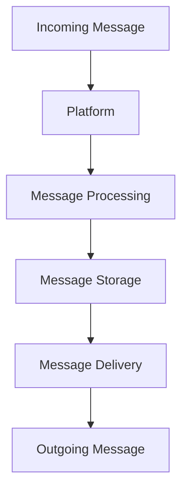

# Message Processing

Quy trình xử lý tin nhắn chatbot.

1. Platform gửi request chứa thông tin tin nhắn đến địa chỉ webhook định trước của chatbot
2. Chatbot nhận request và đưa vào hàng đợi xử lý, phản hồi ok để ghi nhận

